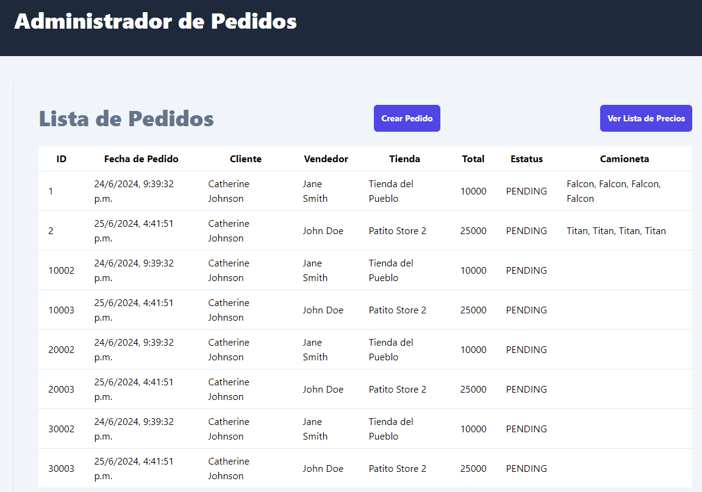

Tecnologías Utilizadas

El frontend de la aplicación para la gestión de pedidos de camionetas HAWA está desarrollado utilizando las siguientes tecnologías:

React 18: Librería de JavaScript utilizada para construir interfaces de usuario dinámicas y reutilizables.
Vite: Herramienta de construcción de frontend rápida y moderna que optimiza el rendimiento durante el desarrollo y la producción.
JavaScript (ES6+): Lenguaje principal utilizado para desarrollar la lógica y componentes del frontend.
React Router: Librería utilizada para la navegación en la aplicación, permitiendo la creación de rutas dinámicas y amigables.
Tailwind CSS: Framework de CSS utilitario para construir diseños rápidos y personalizados directamente en los componentes de React.
Descripción del Proyecto
El frontend está diseñado para interactuar con el backend de gestión de pedidos de camionetas HAWA, proporcionando una interfaz de usuario para los usuarios finales. La aplicación permite a los usuarios realizar y gestionar pedidos, visualizar información de pedidos, crear pedidos.

Funcionalidades Principales

Gestión de Pedidos: Páginas para crear, actualizar y eliminar pedidos, así como para visualizar la lista de pedidos realizados.

Formulario de Pedido: Formulario interactivo para que los usuarios puedan crear y gestionar pedidos, incluyendo la selección de camionetas, tiendas, clientes y vendedores.

Integración con Backend
El frontend se comunica con el backend a través de API RESTful, utilizando los endpoints documentados en Swagger. La interfaz de usuario está diseñada para consumir estos endpoints y mostrar los datos de manera interactiva y dinámica.

Navegación y Rutas

La aplicación utiliza React Router para manejar la navegación entre diferentes páginas. A continuación se muestran algunas de las rutas principales.

Uso de Tailwind CSS
Tailwind CSS se utiliza para el diseño rápido y eficiente de la interfaz de usuario. Proporciona clases utilitarias que se aplican directamente a los elementos de los componentes de React.

Instalar Dependencias:

bash
Copiar código
npm install
Ejecutar en Desarrollo:

bash
Copiar código
npm run dev
Construir para Producción:

bash
Copiar código
npm run build

